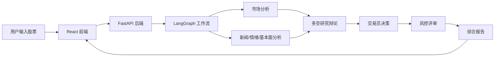

# AStock 智能选股 Agent

AStock 是一个面向 A 股研究场景的智能选股 Agent 项目。系统通过前端页面接收用户输入，由 FastAPI 后端调度 LangGraph 多 Agent 工作流，结合行情、资金、新闻、基本面等工具数据，生成结构化分析报告和风险提示。

本项目定位于课程展示、Agent 架构学习和工程实践，不连接券商交易接口，不执行实盘交易，也不构成任何投资建议。

## 核心能力

- 支持输入 A 股代码或股票名称，生成个股分析报告。
- 使用 LangGraph 编排多个分析、辩论、交易和风控节点。
- 接入 DeepSeek API，使用 OpenAI SDK 兼容调用方式。
- 在缺少 Tushare Token 时自动进入稳定模式，优先使用 AKShare 等公开数据源。
- 支持前端进度展示、历史报告查看和智能对话解释。
- 支持本地运行和腾讯云 CVM 部署。

## 技术栈

- Python 3.10
- FastAPI
- React + Vite
- LangGraph
- LangChain
- pandas / numpy
- AKShare / Tushare
- DeepSeek API
- Nginx / systemd

## 项目结构

```text
AStock-AI-Agent/
  stock_agent/            # 多 Agent 核心逻辑
    agents/               # 分析师、研究员、交易员、风控等角色
    graph/                # LangGraph 工作流编排
    dataflows/            # 行情、新闻、基本面等数据工具
  web-app/
    frontend/             # React 前端页面
    backend/              # FastAPI 后端服务
  docs/                   # 部署和项目文档
  config/                 # 配置文件
  tests/                  # 单元测试
  .env.example            # 环境变量模板
```

## 系统流程



前端负责输入和展示，后端负责请求处理和任务调度，LangGraph 负责决定各个 Agent 节点的执行顺序。每个 Agent 可以理解为“提示词、LLM、工具调用和状态读写”的组合。

## Agent 角色

完整分析链路中包含 13 个核心角色：

- Market Analyst，市场分析师
- Social Analyst，社交情绪分析师
- News Analyst，新闻分析师
- Fundamentals Analyst，基本面分析师
- Bull Researcher，多头研究员
- Bear Researcher，空头研究员
- Research Manager，研究经理
- Trader，交易员
- Risky Analyst，激进风控分析师
- Neutral Analyst，中性风控分析师
- Safe Analyst，保守风控分析师
- Risk Judge，风控裁判
- Consolidation Report，综合报告节点

这些角色会先分别形成分析意见，再经过多空辩论、交易决策和风控复核，最后生成统一的综合报告。

## 本地启动

### 1. 创建 Python 环境

```bash
cd D:\llm_lab\AStock-AI-Agent
python -m venv .venv
.\.venv\Scripts\activate
pip install -r requirements.txt
pip install -r web-app\backend\requirements.txt
```

### 2. 配置环境变量

复制环境变量模板：

```bash
copy .env.example .env
```

建议至少配置：

```env
DEEPSEEK_API_KEY=your_deepseek_api_key
OPENAI_API_KEY=your_deepseek_api_key
OPENAI_BASE_URL=https://api.deepseek.com
DEEPSEEK_BASE_URL=https://api.deepseek.com
JWT_SECRET=change-this-secret
```

`TUSHARE_TOKEN` 是可选项。未配置时，系统会优先使用公开数据源，并自动降低对高权限数据接口的依赖。

### 3. 启动后端

```bash
cd D:\llm_lab\AStock-AI-Agent
.\.venv\Scripts\activate
cd web-app\backend
python -m uvicorn app.main:app --host 127.0.0.1 --port 8000
```

### 4. 启动前端

另开一个终端：

```bash
cd D:\llm_lab\AStock-AI-Agent\web-app\frontend
npm install
npm run dev
```

访问地址：

```text
http://127.0.0.1:3000
```

本地演示访问码：

```text
demo123456
```

## 云服务器部署

项目当前支持在腾讯云 CVM 上部署：

- 前端由 Nginx 托管。
- 后端 FastAPI 由 systemd 管理。
- 后端服务名为 `stock-agent-backend.service`。

更新服务器代码时可以执行：

```bash
cd /home/ubuntu/stock-agent
git pull origin main
sudo systemctl restart stock-agent-backend.service
sudo systemctl status stock-agent-backend.service --no-pager
```

更完整的部署说明见 [docs/deployment_tencent_cloud.md](docs/deployment_tencent_cloud.md)。

## 课堂展示建议

建议按以下顺序讲解：

1. 说明项目目标：用多 Agent 架构完成 A 股研究报告生成。
2. 展示前端输入股票代码和分析日期。
3. 解释请求如何进入 FastAPI 后端。
4. 展示 LangGraph 如何组织分析师、研究员、交易员和风控节点。
5. 展示分析进度、综合报告和风险提示。
6. 强调数据和模型的边界：工具负责获取数据，LLM 负责整理、推理和生成表达。

## 注意事项

- `.env` 中的 API Key 不能提交到 GitHub。
- 系统输出仅供学习和展示，不应作为真实投资依据。
- LLM 生成内容可能存在误差，关键结论需要结合原始数据复核。
- 若部署到公网服务器，建议配置更强的访问控制和日志监控。

## 免责声明

本项目仅用于课程学习、Agent 架构展示和工程实践，不提供任何投资建议。系统输出中的“候选股票”“策略分析”“买入/卖出/持有”等内容仅代表模型生成的研究文本，不应被理解为真实交易指令。投资有风险，决策需谨慎。
