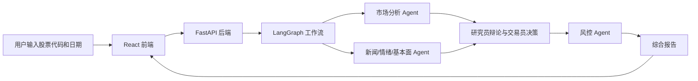

# AStock 智能选股 Agent 课堂演示版

这是一个面向课堂展示和项目讲解的 A 股智能选股 Agent。项目基于开源多 Agent 股票分析框架改造，保留“前端页面 + 后端服务 + LangGraph 多 Agent 编排 + 行情/新闻工具调用”的完整链路，同时加入了更适合演示的稳定模式。

本项目不做实盘交易，不连接券商接口，不构成投资建议。

## 我们改造了什么

- 接入 DeepSeek 兼容 OpenAI SDK 的调用方式。
- 没有 Tushare Token 时，自动进入课堂稳定模式。
- 无 Tushare 时优先运行市场分析 Agent，避免因为缺少高权限数据接口导致整条流程失败。
- DeepSeek 不支持 OpenAI Responses 网页搜索接口时，不编造新闻和基本面数据，而是给出明确说明。
- 本地数据、缓存、ChromaDB 路径支持通过环境变量配置，方便放在 D 盘或云服务器目录。
- 增加本地演示访问码，方便课堂快速进入页面。

## 技术栈

- Python 3.10
- FastAPI
- React + Vite
- LangGraph
- LangChain
- pandas / numpy
- AKShare / 其他数据工具
- DeepSeek API
- Nginx，可选，用于云服务器部署

## 项目结构

```text
AStock-AI-Agent/
  tradingagents/          # 多 Agent 核心逻辑
    agents/               # 分析师、研究员、交易员、风控等角色
    graph/                # LangGraph 工作流编排
    dataflows/            # 行情、新闻、基本面等工具
  web-app/
    frontend/             # React 前端页面
    backend/              # FastAPI 后端服务
  docs/                   # 文档
  config/                 # 配置文件
  .env.example            # 环境变量模板
```

## 本地启动

### 1. 创建环境

```bash
cd D:\llm_lab\AStock-AI-Agent
python -m venv .venv
.\.venv\Scripts\activate
pip install -r requirements.txt
pip install -r web-app\backend\requirements.txt
```

### 2. 配置环境变量

复制模板：

```bash
copy .env.example .env
```

课堂演示建议至少填写：

```env
DEEPSEEK_API_KEY=你的 DeepSeek API Key
OPENAI_API_KEY=你的 DeepSeek API Key
OPENAI_BASE_URL=https://api.deepseek.com
DEEPSEEK_BASE_URL=https://api.deepseek.com
JWT_SECRET=change-this-secret
```

如果没有 `TUSHARE_TOKEN`，系统会进入课堂稳定模式，只跑更稳的市场分析链路。

### 3. 启动后端

```bash
cd D:\llm_lab\AStock-AI-Agent
.\.venv\Scripts\activate
cd web-app\backend
python -m uvicorn app.main:app --host 127.0.0.1 --port 8000
```

### 4. 启动前端

另开一个终端：

```bash
cd D:\llm_lab\AStock-AI-Agent\web-app\frontend
npm install
npm run dev
```

访问：

```text
http://127.0.0.1:3000
```

本地演示访问码：

```text
demo123456
```

## Agent 流程怎么讲

这个项目可以这样理解：



前端负责收集输入和展示结果；后端负责接收请求、管理任务；LangGraph 负责把多个 Agent 节点按顺序组织起来；每个 Agent 本质上是“提示词 + LLM + 工具调用 + 状态读写”。

## 原项目有多少 Agent

默认完整链路里有 13 个核心角色：

- Market Analyst，市场分析师
- Social Analyst，社交情绪分析师
- News Analyst，新闻分析师
- Fundamentals Analyst，基本面分析师
- Bull Researcher，多头研究员
- Bear Researcher，空头研究员
- Research Manager，研究经理
- Trader，交易员
- Risky Analyst，激进风控分析师
- Neutral Analyst，中性风控分析师
- Safe Analyst，保守风控分析师
- Risk Judge，风控裁判
- Consolidation Report，综合报告节点

课堂稳定模式会减少对外部高权限数据接口的依赖，优先保证流程能跑通、能讲清楚。

## 云服务器部署

见 [docs/deployment_tencent_cloud.md](docs/deployment_tencent_cloud.md)。

## 课堂展示建议

1. 先说明这是一个教学演示系统，不是实盘交易系统。
2. 展示前端输入股票代码和日期。
3. 解释前端请求进入 FastAPI 后端。
4. 展示 LangGraph 如何把多个 Agent 串起来。
5. 展示分析进度、报告和风险提示。
6. 说明确定性数据和 LLM 解释的边界：行情数据由工具获取，LLM 负责整理、推理和生成报告。

## 风险声明

本项目仅用于课程学习、Agent 架构展示和工程实践，不提供任何投资建议。系统输出中的“观察标的”“候选股票”“策略分析”等内容不应被理解为买入、卖出或持有建议。真实投资需要结合个人风险承受能力，并咨询持牌专业人士。
